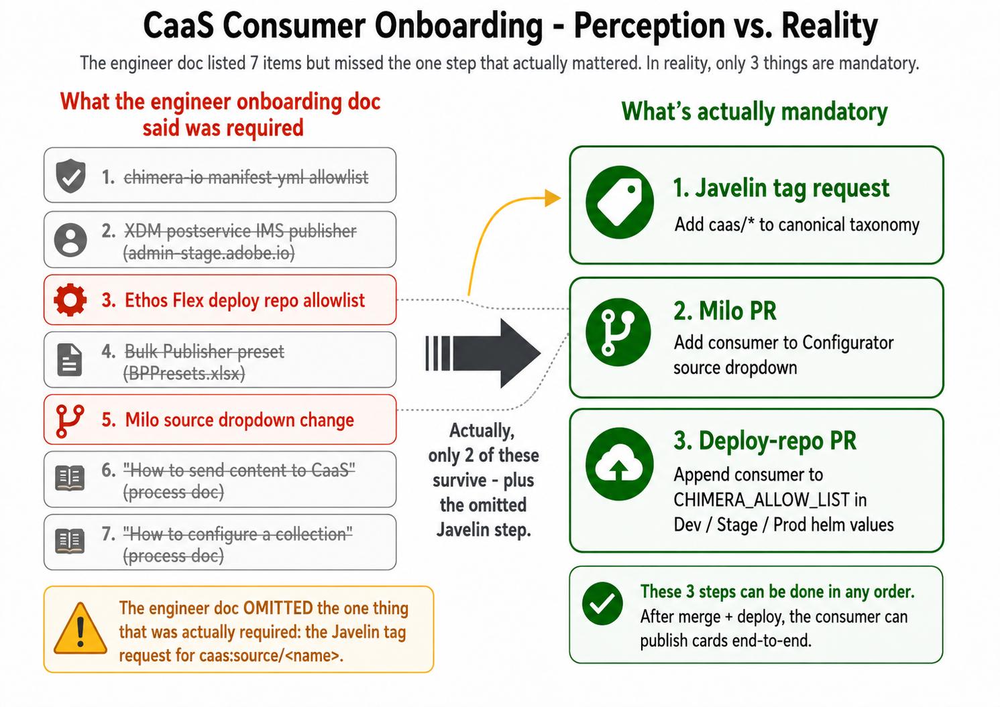

# Consumer Onboarding

How to onboard a new adobe.com property as a CaaS source. A "consumer" is a property like `bacom`, `news`, `doccloud`, `edu`, etc. that publishes cards into the CaaS / Chimera pipeline.

## At a glance



The diagram above contrasts the historical engineer-authored onboarding doc (left, 7 items, also missing the one step that actually mattered) against the three mandatory steps documented below (right). If you only have a minute, look at the right side: that's the canonical list. The detailed runbook follows.

This runbook is intentionally lean. It anchors each step to durable concepts (symbol names, existing-consumer names) rather than file paths or line numbers, because the implementations drift. An AI agent reading this should be able to locate the current files by searching the named repos for the named anchors.

> **Reference example:** the `edu` consumer was onboarded in May 2026 under ticket MWPW-193054. Search recent merged PRs in `adobecom/milo` and `wcms/chimera-xdm-postservice-deploy` for that ticket to see concrete diffs.

> **Scope of this runbook — US / single-locale only.** This is the standard CaaS onboarding path. It enables card publishing for one locale (typically US English). Multi-locale support (Lingo / language-first routing for `/fr/`, `/de/`, regional overrides like `/be_fr/`, etc.) is **out of scope** for this team and is not covered here. Consumers needing locale support should ship core CaaS first, validate it works for US, then coordinate separately with the team that owns Lingo for follow-on work.

---

## Mandatory steps

These three steps gate publishing. Without all three, the consumer cannot push cards into Chimera.

### 1. Request the Javelin tag

**What:** a canonical taxonomy entry of the form `caas:source/<consumer-name>` so the chimera tags API recognizes the new source.

**Where:** submit via the team's Javelin process. Coordinate with the team lead in `#javelin-friends` Slack. Tag requests are batched on a weekly cycle (Thursdays at time of writing); allow ~24 hours from acceptance for the new tag to land in production.

**Fields the request needs:**
- `tagID`: `caas:source/<consumer-name>` (lowercase)
- `name`: `<consumer-name>`
- `title`: human-readable display name (e.g. `Edu`, `BACOM`)
- `path`: `/content/cq:tags/caas/source/<consumer-name>`
- `description`: optional

**Verify:** once landed, this command should print the new consumer:

```bash
curl -s "https://www.adobe.com/chimera-api/tags?cb=$(date +%s)" \
  | python3 -c "import json,sys; d=json.load(sys.stdin); \
    print(sorted(d['namespaces']['caas']['tags']['source']['tags'].keys()))"
```

### 2. Add the consumer to the Configurator's source dropdown (Milo PR)

**What:** add the new consumer to the `source` map used by the CaaS Configurator UI. Authors select this value when tagging a card.

**Where:** in `adobecom/milo`, search for `defaultOptions.source` or look up an existing consumer name like `bacom` or `doccloud`. Currently lives in `libs/blocks/caas-config/caas-config.js`, but follow the symbol if it moves.

**Shape:** alphabetical insertion of `<consumer>: '<Display Name>'` into the `source` map.

**Why:** without this entry, authors cannot select the new source from the dropdown in the Configurator, so they cannot tag pages with it via the UI.

**Verify:** open the Configurator locally or against a stage Helix link; the new entry should appear in the source dropdown.

### 3. Append the consumer to `CHIMERA_ALLOW_LIST` (deploy repo PR)

**What:** add the consumer name to the allowlist enforced by `chimera-xdm-postservice` (the Java/Spring write service in `wcms/chimera-xdm-postservice`). Without this, every XDM POST with the new `origin` value returns HTTP 400 — `The XDM is invalid, the origin: <name>, is not within the allowlist: [...]`.

**Where:** in `wcms/chimera-xdm-postservice-deploy`, edit the helm values files for all three environments. Anchor: `CHIMERA_ALLOW_LIST`. Currently:
- `k8s/helm/Dev/va6/values.yaml`
- `k8s/helm/Stage/va6/values.yaml`
- `k8s/helm/Production/va6/values.yaml`

**Shape:** append `,<consumer-name>` to the existing comma-separated value string. No space after the comma — match the existing pattern.

**Why:** the post-service rejects any `origin` field not in this list before writing to OpenSearch.

**Verify:** after merge, Glider auto-deploys Dev → Stage → Production. Once Stage is deployed, run an end-to-end POST against stage chimera with `origin: <consumer-name>` — see "Run the e2e validation curl" under optional steps.

---

## Optional / supporting steps

These are not blockers for the consumer team to start publishing, but most onboardings include them.

### Add a Bulk Publisher preset

**What:** an entry in `bppresets.json` so the Bulk Publisher UI offers the new consumer as a one-click preset (host, owner, repo, preview host, etc.).

**Where:** the live file at `https://milo.adobe.com/drafts/caas/bppresets.json`. It is edited via the SharePoint-mounted `drafts/caas/` folder, not via a GitHub PR.

**Why:** quality-of-life for the consumer team and for the CaaS team during validation. Without it, users have to type the preset fields manually each time.

### Coordinate the consumer's `helix-query.yaml`

**What:** ensure the consumer's `helix-query.yaml` (in their own repo, e.g. `adobecom/<consumer>`) includes the `caas-url` property so query-index emits which pages embed which CaaS collections.

**Where:** in the consumer's repo root or `.helix/` folder.

**Why:** enables per-page rollout precision and visibility into which URLs depend on which CaaS collections. Cheap to set up at onboarding time; expensive to backfill later (every existing page needs to be re-published to regenerate query-index rows).

### Add the canonical taxonomy fallback in `caas-tags.js` (Milo PR)

**What:** a hardcoded source-taxonomy node in Milo's `caas-tags.js` mirroring what the Javelin tag adds to the live taxonomy API.

**Where:** in `adobecom/milo`, search for an existing source name like `bacom` inside `caas-tags.js`.

**Why:** belt-and-suspenders fallback for cases where the canonical taxonomy API is unreachable or has lag. The runtime lookup against `chimera-api/tags` is the primary source of truth; this is the local fallback.

### Author a test page with a `card-metadata` block

**What:** a published page on the consumer's site that contains a `card-metadata` block. This is the regression surface for the consumer's CaaS pipeline.

**Where:** somewhere convenient on the consumer's site. A `/drafts/` path is typical for test pages and usually avoids touching production-bound surfaces.

**Why:** validates that the consumer's authoring → Helix preview → published-page flow correctly surfaces the metadata block. Without this you have nothing to send through Bulk Publisher.

### Run the e2e validation curl

**What:** after `CHIMERA_ALLOW_LIST` has deployed to stage, POST a real XDM payload against stage chimera with the new `origin` value and confirm HTTP 201, then verify the card surfaces in stage chimera.

**Why:** the only way to confirm the full pipeline (Bulk Publisher → milocaasproxy → chimera-xdm-postservice → OpenSearch → chimera-io read) works end-to-end for the new consumer.

**Verify:** query the read service for the card you just published:

```bash
curl -s "https://14257-chimera-stage.adobeioruntime.net/api/v1/web/chimera-0.0.1/collection?originSelection=<consumer-name>&featuredCards=<entity-id>&size=1&country=us&language=en" \
  | python3 -m json.tool
```

If the card returns, the pipeline is validated. Empty after two minutes indicates an indexing delay or upstream failure — see [TROUBLESHOOTING.md](TROUBLESHOOTING.md).

---

## After-launch follow-ups

- Confirm the consumer team understands the `card-metadata` block authoring pattern.
- Confirm they have a designated test page they can re-validate against on future deploys.
- Note the launch date and consumer name in the team's release tracking (so post-launch regressions can be correlated).

---

_Last verified: 2026-05-14 (against the `edu` onboarding under MWPW-193054). If you are reading this much later than that date and any anchor below has drifted, prefer the most recent merged consumer-onboarding PR over this runbook._
